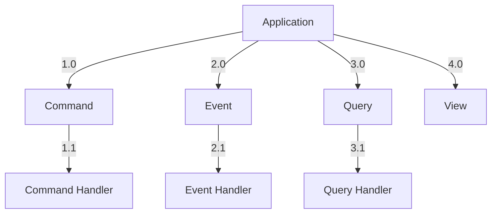
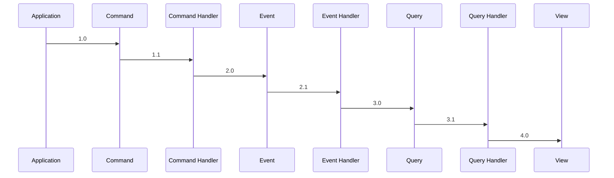

# accounting-pattern

Implementation of Martin Fowler's [accounting patterns article](http://martinfowler.com/apsupp/accounting.pdf) and [Accounting Narrative](http://martinfowler.com/eaaDev/AccountingNarrative.html).

## Summary

The accounting pattern is a design pattern used to manage financial transactions and ensure accurate financial reporting. It involves the following key concepts:

- **Transaction**: Represents a financial event that affects accounts.
- **Entry**: A record within a transaction that specifies the amount and the account affected.
- **Account**: Represents a ledger account where entries are recorded.
- **Ledger**: A collection of accounts that tracks all financial transactions.

The pattern ensures that all transactions are balanced, meaning the total debits equal the total credits, which is crucial for maintaining accurate financial records.

# Pattern

