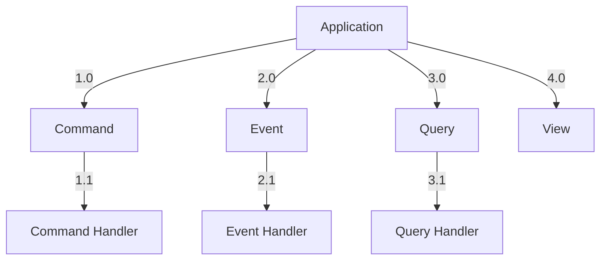
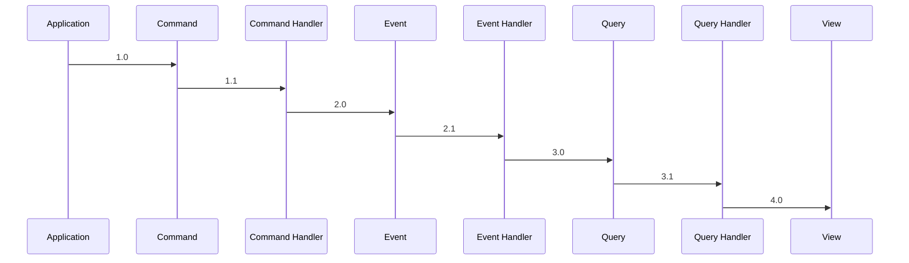

# Accounting Pattern

Implementation of Martin Fowler's http://martinfowler.com/apsupp/accounting.pdf accounting patterns article. Also http://martinfowler.com/eaaDev/AccountingNarrative.html

```mermaid
graph TD
    A[Application] -->|1.0| B[Command] -->|1.1| C[Command Handler]
    A -->|2.0| D[Event] -->|2.1| E[Event Handler]
    A -->|3.0| F[Query] -->|3.1| G[Query Handler]
    A -->|4.0| H[View]
```

```mermaid
sequenceDiagram
participant Application
participant Command
participant Command Handler
participant Event
participant Event Handler
participant Query
participant Query Handler
participant View

Application->>Command: 1.0
Command->>Command Handler: 1.1
Command Handler->>Event: 2.0
Event->>Event Handler: 2.1
Event Handler->>Query: 3.0
Query->>Query Handler: 3.1
Query Handler->>View: 4.0
    
```
